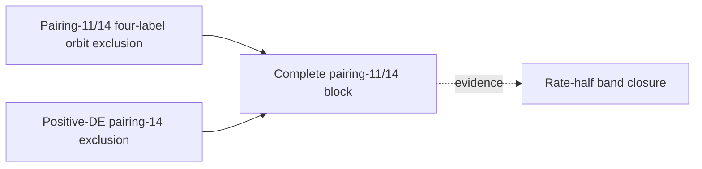

# Dependency Sub-DAG

```mermaid
graph LR
  O[Pairing-11/14 four-label orbit exclusion] --> C[Complete pairing-11/14 block]
  P[Positive-DE pairing-14 exclusion] --> C
  C -. evidence .-> R[Rate-half band closure]
```
