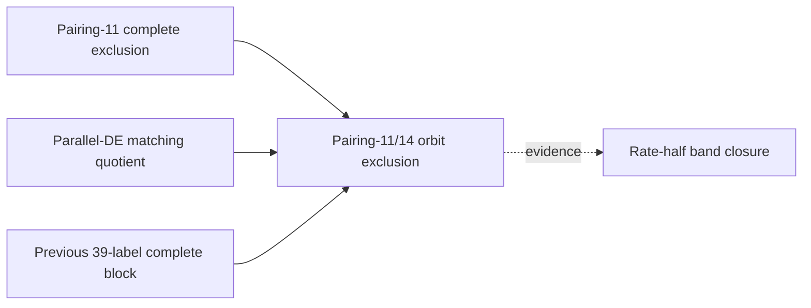

# Dependency Sub-DAG

```mermaid
graph LR
  P[Pairing-11 complete exclusion] --> O[Pairing-11/14 orbit exclusion]
  Q[Parallel-DE matching quotient] --> O
  C[Previous 39-label complete block] --> O
  O -. evidence .-> R[Rate-half band closure]
```

The prior complete block is required only for the cumulative 43-label
ledger; the four-label orbit exclusion itself uses the first two parents.
