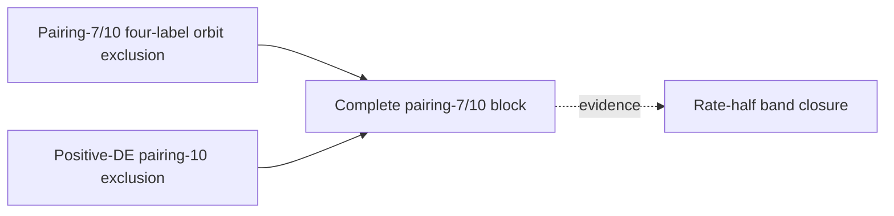

# Dependency Sub-DAG

```mermaid
graph LR
  O[Pairing-7/10 four-label orbit exclusion] --> C[Complete pairing-7/10 block]
  P[Positive-DE pairing-10 exclusion] --> C
  C -. evidence .-> R[Rate-half band closure]
```
