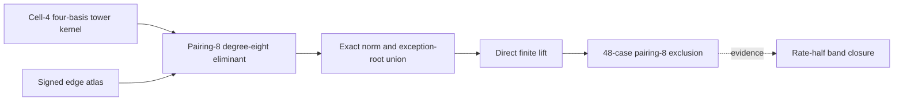

# Dependency Sub-DAG

```mermaid
graph LR
  T[Cell-4 four-basis tower kernel] --> P[Pairing-8 degree-eight eliminant]
  A[Signed edge atlas] --> P
  P --> N[Exact norm and exception-root union]
  N --> L[Direct finite lift]
  L --> X[48-case pairing-8 exclusion]
  X -. evidence .-> R[Rate-half band closure]
```

The tower and signed atlas are required parents. The conclusion is evidence
for the rate-half band; it is not a substitute for the remaining cell-4
slices.
