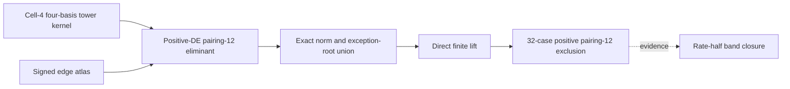

# Dependency Sub-DAG

```mermaid
graph LR
  T[Cell-4 four-basis tower kernel] --> P[Positive-DE pairing-12 eliminant]
  A[Signed edge atlas] --> P
  P --> N[Exact norm and exception-root union]
  N --> L[Direct finite lift]
  L --> X[32-case positive pairing-12 exclusion]
  X -. evidence .-> R[Rate-half band closure]
```
